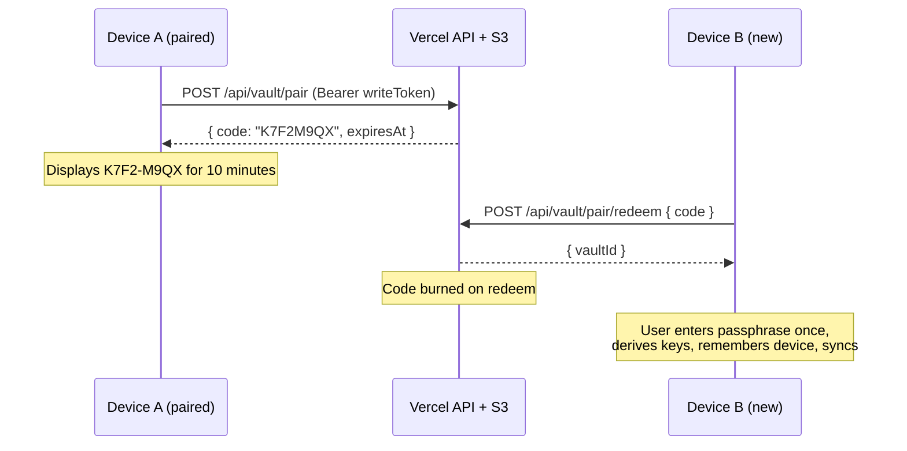

# Ambient Vault Sync

Design doc for turning the manual, passphrase-per-sync vault into sync that
just happens — notes converge in the cloud on save, pairing a device costs
eight characters, and the passphrase is typed once per device instead of once
per sync.

Successor to [passwordless-vault-sync.md](./passwordless-vault-sync.md), whose
Phases A–D shipped as issues #19–#21. That doc's crypto model, merge rules,
and S3 layout are **unchanged** here. This doc changes *when* sync runs, *what
the device remembers*, and *how a second device joins*.

## Why

Two frictions, both reported from real use.

**Pairing.** The vault id is a UUID — `vlt_` + 36 characters. It is the
permanent address of the vault, displayed in the Cloud Sync modal for the user
to copy to a second device. On a phone, hand-transcribing it is miserable, and
it is too long to read aloud or remember.

**Every sync.** `SyncModal` re-collects the passphrase on every single sync by
design, and `deriveVaultKeys` runs scrypt at `N=2^17` — a deliberate ~1–2s
main-thread block, which is why `run()` yields a frame just to paint
"Syncing…" before it. Routine sync is therefore: open modal → type passphrase
→ wait two seconds → press a button. The on-return auto-sync nudge in
`App.tsx` cannot actually sync; it can only *open the passphrase prompt*,
because there is nothing on the device to sync with.

The second friction is the larger one, and fixing it turns out to make the
first one mostly irrelevant: once a device remembers its keys, pairing is a
**one-time** act, so a short typed code is sufficient and a QR/camera path
stops earning its complexity.

## The rule: cloud as convergence point, not authority

"Cloud is the source of truth" and "local-first" are in tension, and the
tension is resolved deliberately:

> **Local storage stays canonical for reading and writing.** The vault is the
> *convergence point* that every device reconciles against automatically, not
> an authority that gates local edits.

A device that is offline, or whose keys are not resident, keeps working
exactly as it does today — edits land in local storage and converge later.
Making the cloud genuinely authoritative (local as pure cache) would break
offline editing, which is the app's identity. Nothing below requires it.

---

## Part 1: Resident keys (the prerequisite)

Encrypt-on-save requires the derived keys to already be in memory. Everything
else in this doc sits behind this piece, and it is the only piece that crosses
the `AppApi` platform boundary.

### What is remembered

**Not the passphrase.** The passphrase is never persisted, in keeping with the
original design. What a device remembers is the *derived* material from
`deriveVaultKeys(passphrase, vaultId)`:

| Material | Remembered as | Why |
|----------|---------------|-----|
| `encryptionKey` | A **`CryptoKey`**, non-extractable where the platform allows | Grants read access to note plaintext — the secret that matters |
| `writeToken` | A string | Must be serializable: it rides in an `Authorization: Bearer` header |

The split is deliberate and worth stating plainly, because it is the honest
cost of remembering anything on the web target:

- The `encryptionKey` can be stored as a **non-extractable `CryptoKey`**
  structured-cloned into IndexedDB. Script can *use* it to decrypt but cannot
  read out its bytes. On Electron and iOS it is sealed by the OS instead.
- The `writeToken` **cannot** be protected that way on web — it must be
  readable to become a header value. So on web, an XSS on the app origin can
  steal the write token and *overwrite* the vault's ciphertext. It cannot read
  any note plaintext.

Destructive-but-not-confidential is a defensible exposure for a remembered
session, and the vault's snapshot history in S3 is the mitigation if it is
ever considered too sharp. It should be stated in the UI copy next to
"Remember this device", not buried here.

### `VaultKeyStore` — the new seam

The abstraction must **not** be "store a secret string", because the web
target cannot hand back key bytes and should not be asked to. The port returns
a *usable handle*, not raw material:

```typescript
// src/services/vaultKeyStore.ts
export interface ResidentKeys {
  /** Usable for AES-GCM; non-extractable on web, OS-sealed elsewhere. */
  encryptionKey: CryptoKey;
  writeToken: string;
}

export interface VaultKeyStore {
  available(): Promise<boolean>;
  remember(vaultId: string, keys: VaultKeys): Promise<void>;
  recall(vaultId: string): Promise<ResidentKeys | null>;
  forget(vaultId: string): Promise<void>;
}
```

### Required change to `vaultCrypto.ts`

`encryptSnapshot` / `decryptSnapshot` currently take raw `Uint8Array` key
material and call `crypto.subtle.importKey` internally. A non-extractable
`CryptoKey` can never be expressed as a `Uint8Array`, so **both must accept a
`CryptoKey`**, with import moved out to the caller:

```typescript
// deriveVaultKeys keeps returning raw bytes (it must — it derives them);
// the caller imports once and holds the CryptoKey for the session.
export async function importEncryptionKey(raw: Uint8Array): Promise<CryptoKey>;
export async function encryptSnapshot(key: CryptoKey, vaultId: string, plaintext: string): Promise<VaultEnvelope>;
export async function decryptSnapshot(key: CryptoKey, vaultId: string, envelope: VaultEnvelope): Promise<string>;
```

This is a small, mechanical refactor, but it touches `vaultSync.ts`'s
`createVault` / `syncVault` / `syncOnce` signatures and their tests. Doing it
first keeps the later phases clean.

### Per-platform implementation

| Target | Encryption key | Write token | Notes |
|--------|----------------|-------------|-------|
| **Electron** | `safeStorage.encryptString` in main; ciphertext in the settings file | Same | Gate on `safeStorage.isEncryptionAvailable()` — on Linux this depends on an available keyring, so it can legitimately be `false`. |
| **iOS** | Keychain, `kSecAttrAccessibleAfterFirstUnlockThisDeviceOnly` | Same | *This-device-only* deliberately keeps it out of iCloud Keychain and encrypted backups; *after-first-unlock* lets a backgrounded sync succeed. |
| **Web** | Non-extractable `CryptoKey` in IndexedDB | Plain record in the same store | No OS keychain exists. This is the standard web answer, with the exposure noted above. |

Electron and iOS need new `AppApi` methods (`secureSet` / `secureGet` /
`secureDelete` / `secureAvailable`, all optional) implemented in **all three**
shims per the `AppApi` convention; the web shim's implementations back onto
IndexedDB rather than a host keychain.

### Behaviour when unavailable

`available()` returning `false` is a supported state, not an error: the device
falls back to exactly today's behaviour — manual sync with a passphrase
prompt. "Remember this device" is a checkbox in the sync flow, defaulting to
**on** where available, and every code path must tolerate `recall()` returning
`null`.

---

## Part 2: Pairing a device in eight characters

With keys resident, pairing happens **once per device**, so it only has to be
tolerable, not instant. A short-lived, server-brokered code is the simplest
thing that works in every direction — desktop→phone, phone→web,
desktop→desktop — with no camera, no QR dependency, and no deep-link plumbing.

### Flow



### Code format

Eight characters of **Crockford base32** (no `I`, `L`, `O`, `U`, so nothing
reads ambiguously and `0`/`O` and `1`/`I` cannot be mistyped), displayed as
`K7F2-M9QX` and accepted case-insensitively with the hyphen optional. That is
40 bits of entropy.

### Storage and lifecycle

`{prefix}/pairing/{code}.json` → `{ vaultId, expiresAt }`, alongside the
existing `vaults/` prefix:

- **TTL 10 minutes**, enforced by comparing `expiresAt` on redeem (an S3
  lifecycle rule on the `pairing/` prefix is the backstop, not the mechanism —
  lifecycle expiry is not prompt enough to rely on).
- **Single use** — deleted on successful redeem.
- **Minting requires the write token**, so only a device that already holds
  the passphrase-derived keys can create a pairing code.

### Why 40 bits is enough

An attacker enumerating the code space gets roughly 60,000 guesses per
10-minute window at a sustained 100 req/s, against a space of 1.1×10¹². With
one code live, that is a hit probability around 5×10⁻⁸ per window. And a hit
yields **only the vault id** — the same public address the UI displays today
— which without the passphrase is an address for ciphertext the attacker
cannot read and cannot overwrite.

This is strictly *stronger* than today's UX, where the vault id is copied into
clipboards, chat apps, and notes-to-self and stays valid forever.

### Rejected pairing alternatives

| Alternative | Why not |
|---|---|
| Derive the vault id from the passphrase (or email + passphrase) | Removes the code entirely, but makes every vault **enumerable** — anyone can compute a user's address and pull their ciphertext for the offline brute-force attack the original doc names as the known weak point. Hands attackers the front door. |
| Permanently shorter vault id | Still 12+ characters to type, needs a migration for existing vaults (the id salts the KDF, so it cannot be re-issued without re-encrypting), and degrades unguessability forever rather than for ten minutes. |
| QR code carrying a sealed key handoff | Genuinely one-step, and the right answer *if pairing were frequent*. With resident keys it is a once-per-device act, so a QR library, an iOS camera permission, and a second server-side payload shape do not pay for themselves. Revisit if pairing ever becomes routine. |
| Passkey / WebAuthn PRF (no passphrase at all) | The real endgame — Face ID on device B, key material synced by iCloud Keychain. PRF support is uneven across Safari and Electron's Chromium, and it is a rewrite of the crypto seam rather than an addition to it. Follow-up track. |

---

## Part 3: The ambient sync loop

Keep the **existing single-snapshot engine**. Per-note S3 objects
(`notes/{id}.enc` + an index) are the eventual answer for large libraries, but
they mean a new layout, per-note conflict handling, an index file, and a
migration — and they are not needed yet. The snapshot is capped at 4MB; 500
notes at 2KB is about 1MB, and with pushes coalesced to *"after the user stops
typing"* rather than *"every N seconds"*, a real editing session produces a
handful of uploads. `syncOnce`'s ETag-conditional PUT and `VaultConflictError`
retry already handle two devices racing.

### Push

Triggered when the `noteSaves` coordinator reports a **successful local
save** — sync is downstream of local persistence, never a precondition for it.

- **Coalesce**: debounce `SYNC_PUSH_MS = 10_000` after the last successful
  save, so a typing burst produces one upload.
- **Flush immediately** on window blur / `pagehide`, on note switch, on the
  `checkDirty` close handshake, and on manual "Sync now".
- **Single-flight**: never two cycles in flight. A push requested mid-cycle
  sets a dirty flag and re-runs once the current cycle settles.
- **Backoff**: exponential from 5s to 5min on failure, reset on success.
  Offline (`navigator.onLine` false, or a network-level fetch failure) parks
  the queue rather than burning retries.

### Pull

- On window focus, and every `SYNC_PULL_MS = 60_000` while focused.
- **Conditional**: `GET /api/vault/:id/snapshot` with the last known ETag, so
  an unchanged vault costs a 304 and no download.

> **Server change required.** The GET branch of `api/vault/[id]/snapshot.ts`
> currently always returns the full envelope; it does not honour a conditional
> request. Polling without 304 support would re-download the whole snapshot
> every minute per device. Add `X-Vault-If-None-Match: <etag>` → `304` on the
> GET path. The custom header name and the CORS allowlist for it
> (`applyCors`) **already exist** — only the GET handler is missing.

Freshness is decided from the **snapshot ETag**, never `meta.updatedAt`:
`meta.json` is advisory-only and its unconditional PUT can transiently
regress, as the original doc's Phase B notes record.

### Status, not modals

Ambient sync must stop opening a modal to do its job. `EditorChrome` gains a
quiet status affordance — idle / syncing / offline / error — and the Cloud
Sync modal becomes a place you go to *manage* sync (pair a device, see the
code, turn it off), not a place you go to *perform* it. `App.tsx`'s on-return
nudge stops calling `openSyncModal(true)` and simply requests a pull.

---

## Part 4: Shaping the port for user-owned storage

The long-term goal is that a user can point sync at storage they own. The
format question resolves cleanly once it is framed as *whose storage is it*:

| Backend | Trust boundary | Format |
|---------|----------------|--------|
| **Our S3** | We are an untrusted host | **Encrypted** `snapshot.enc` — E2E is mandatory, and the stored object is necessarily opaque |
| **Their iCloud Drive / folder / WebDAV** | The user's own storage | **Plaintext `.md` files** — readable in Finder, Obsidian, or anything else; encryption is the user's choice, not ours to impose |

This is a rule, not a contradiction: **the storage adapter decides the
format.** "Owning your data" in a folder you control means owning files you
can actually open — encrypting them would defeat the point of moving them
there.

The consequence for this work: `VaultTransport` is currently shaped entirely
around a single opaque envelope (`getSnapshot` / `putSnapshot` /
`VaultEnvelope`). A plaintext-`.md`-per-note backend is a different shape. The
port should be split now, while there is one implementation, rather than
retrofitted later:

- **`VaultTransport`** stays as-is — the envelope-oriented remote for our S3.
- A **`SyncBackend`** interface above it expresses the operation the app
  actually needs (*"converge this library with the remote"*), so an
  envelope-snapshot backend and a file-per-note backend are both
  implementations of it.

No second backend is built in this track. The point is only that the seam
exists where it will be needed, and that `vaultSyncController.ts` talks to
`SyncBackend` rather than reaching for `VaultTransport` directly.

---

## Phases

### Phase F — Resident keys
`vaultKeyStore.ts`; `CryptoKey` refactor in `vaultCrypto.ts` and its callers;
`secure*` on `AppApi` implemented in all three shims; "Remember this device"
in the sync flow; graceful fallback when unavailable.

### Phase G — Pairing codes
`POST /api/vault/pair` + `POST /api/vault/pair/redeem`; `pairing/` prefix and
lifecycle rule; Crockford base32 codec; mint/redeem views in `SyncModal`
replacing the raw vault-id display.

### Phase H — Ambient loop
Push debounce and coalescing off the `noteSaves` coordinator; focus/interval
pull; conditional GET (client **and** the missing server 304); single-flight,
backoff, offline parking; sync status in `EditorChrome`; retire the
`openSyncModal(true)` nudge.

### Phase I — Backend seam
Extract `SyncBackend`; point `vaultSyncController.ts` at it; no second
implementation.

### Deferred
Per-note S3 objects (revisit on library size); QR/sealed pairing handoff;
passkey/WebAuthn PRF; the plaintext-`.md` user-owned backend itself.

---

## Acceptance criteria

```gherkin
Feature: Resident keys

  Scenario: Passphrase is entered once per device
    Given cloud sync is enabled and "Remember this device" was checked
    When the app is restarted and a note is edited
    Then the note reaches the vault without any passphrase prompt

  Scenario: The passphrase itself is never persisted
    Given a device that has remembered its keys
    When every persisted store on that device is inspected
    Then the passphrase does not appear in any of them

  Scenario: Secure storage is unavailable
    Given a host where secure storage reports unavailable
    When cloud sync is enabled
    Then sync still works via the existing passphrase prompt
    And no error is surfaced for the missing capability

Feature: Pairing codes

  Scenario: Pairing a second device
    Given a paired device displaying the code "K7F2-M9QX"
    When a new device redeems that code and enters the passphrase
    Then the new device is synced without the vault id being typed

  Scenario: A code cannot be reused
    Given a pairing code that has been redeemed once
    When it is redeemed again
    Then the request is rejected

  Scenario: A code expires
    Given a pairing code minted more than ten minutes ago
    When it is redeemed
    Then the request is rejected

Feature: Ambient sync

  Scenario: Edits converge without user action
    Given two devices paired to the same vault with resident keys
    When a note is edited on the first device and editing stops
    Then the second device shows the edit after its next pull
    And no sync modal was opened on either device

  Scenario: A typing burst produces one upload
    Given a note being edited continuously for sixty seconds
    When editing stops
    Then exactly one snapshot upload occurs

  Scenario: An unchanged vault costs nothing to poll
    Given a vault whose snapshot has not changed since the last pull
    When the pull interval elapses
    Then the server responds 304 and no envelope is downloaded

  Scenario: Offline edits converge on reconnect
    Given a device that is offline
    When notes are edited and the device reconnects
    Then the edits reach the vault without user action
    And local editing was never blocked while offline
```

---

## Security notes

- **The threat model is unchanged for data at rest.** The server still holds
  only ciphertext and `SHA-256(writeToken)`. Offline brute-force of the
  passphrase by someone holding vault id + ciphertext remains the known weak
  point, throttled only by scrypt.
- **New exposure: remembered keys.** A device that remembers its keys can
  decrypt the vault without the passphrase. That is the entire point, and it
  is why the material is OS-sealed where an OS seal exists, and why
  "Remember this device" is a visible choice rather than a default that is
  never surfaced.
- **New exposure on web only: the write token is readable by same-origin
  script.** Confidentiality is preserved (the encryption key is
  non-extractable); integrity is not. Say so in the UI copy.
- **Pairing codes are capability tokens with a ten-minute life**, single use,
  mintable only by a device holding the write token, and redeemable only for
  the vault id — never for key material.
- **`forget()` on "Turn off sync"** must clear resident keys on that device.
  It remains a local operation: the vault and other devices are untouched, and
  local notes stay on disk, as today.

---

## Implementation notes (2026-09-20)

Landed on `feat/ambient-vault-sync`. Every phase above shipped; this section
records where things live and where the build deviates from the design.

### Where it lives

| Concern | File |
|---------|------|
| Pairing-code codec (shared by API and client) | `shared/pairingCode.ts` |
| `secure*` host surface | `shared/types/ipc.ts` · `src/main.ts` + `src/preload.ts` (Electron `safeStorage`) · `src/ios/capacitorApi.ts` (Keychain via `capacitor-secure-storage-plugin`) · web shim leaves them undefined |
| Resident keys | `src/services/vaultKeyStore.ts` — host strategy, IndexedDB `CryptoKey` strategy, and the memoized chooser |
| `CryptoKey` in the engine | `vaultCrypto.ts` accepts `AesKeyInput = Uint8Array \| CryptoKey`; `importEncryptionKey()`; `vaultSync.ts` gains `syncVaultWithKeys()` and the conditional-pull path; `createVault()` now returns the keys to its caller |
| Session (keys in memory, one backend per vault) | `src/services/vaultSession.ts` |
| Backend seam | `src/services/syncBackend.ts` — `SyncBackend.converge("full" \| "pull-if-changed")`; `createVaultSyncBackend` tracks the ETag |
| Ambient loop | `src/services/ambientSync.ts` — `createAmbientScheduler` (pure, timer-injectable) + `startAmbientSync` runtime + `useSyncStatusStore` |
| Library change bus | `src/services/libraryEvents.ts`; `notesStore` emits on create/update/delete, never on `reloadLibrary` |
| User actions | `src/services/vaultSyncController.ts` — enable / link (code or legacy id) / unlock+sync / mint / turn off |
| Server | `api/_lib/vaultStore.ts` (`createPairing`, `redeemPairing`, conditional `getSnapshot`, `assertWriteToken`), `api/vault/pair/index.ts`, `api/vault/pair/redeem.ts`, 304 branch in `api/vault/[id]/snapshot.ts` |
| Chrome | `SyncIndicator.tsx` in `EditorChrome`; `SyncModal.tsx` views intro / enable / link / unlock / manage / pair / pair-unlock |

### Deviations from the design

- **iOS Keychain accessibility.** The design asked for
  `kSecAttrAccessibleAfterFirstUnlockThisDeviceOnly`. The plugin in use
  (`capacitor-secure-storage-plugin`, SwiftKeychainWrapper underneath) uses
  its default accessibility class and does not expose that knob. Items are
  still non-synchronizable — nothing rides iCloud Keychain — but a
  backgrounded sync before the first unlock after reboot would find the keys
  unavailable. Acceptable for a foreground notes app; revisit if background
  sync ever lands. `bun run ios:sync` on a Mac pulls the pod into Xcode.
- **Electron on Linux without a keyring.** `safeStorage` falls back to its
  `basic_text` backend, which obfuscates rather than encrypts. `main.ts`
  reports secure storage *unavailable* in that case, and the renderer uses
  the IndexedDB `CryptoKey` strategy instead — the same exposure profile as
  the web target, and strictly better than a plaintext-equivalent record.
  The e2e run on this Hyprland box exercised exactly that path.
- **The PUT response carries the new ETag.** The design implied the next
  poll after a push would be unconditional once; in practice the transport
  returns the ETag from the PUT and `syncOnce` threads it through, so even
  the first poll after a push is a 304.
- **Manual "Sync now" shares single-flight with the loop.**
  `AmbientScheduler.syncNow()` waits for the loop to be free and then runs
  its own full cycle, rethrowing so the modal can show the failure. Two
  cycles never race the same device.

### Operator checklist

- **S3 lifecycle rule** on `mmw-sync/pairing/`: expire after 1 day. This is
  only the backstop for codes nobody redeemed — `expiresAt` is enforced on
  every redeem.
- **Vercel Firewall rate limit** on `POST /api/vault/pair/redeem` (e.g.
  30/min/IP). The 40-bit code space is the actual defence; the limit just
  makes enumeration tedious. `POST /api/vault/pair` is already gated by the
  write token.
- Nothing else changes in the bucket layout or IAM scope; the new prefix
  sits under the same `mmw-sync/` the existing IAM user is scoped to.

### Verification

- `bun run typecheck`, `bun run lint` (one pre-existing warning), `bun run
  test` — 267 unit tests across 34 files. New: `pairingCode`,
  `vaultKeyStore`, `ambientSync`, `syncBackend`, plus additions to
  `vaultTransport` and `vaultSync`.
- `bun run test:e2e` — 12 passing, including `e2e/ambient-sync.spec.ts`,
  which drives two Electron instances against an in-memory stub of the API
  with the real store semantics and proves every acceptance scenario above
  except the S3-specific ones: passphrase entered once per device, a typing
  burst → one upload, edits converge unprompted, single-use codes, 304
  polls, restart-to-idle with no prompt, and turn-off forgetting the keys.
- Not exercised here: the real Vercel/S3 endpoints (`/api/vault/pair*` and
  the 304 branch) — same contract as the stub; a live curl pass after deploy
  is the remaining step, as was done for Phase B.
