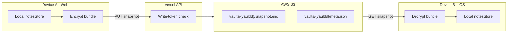
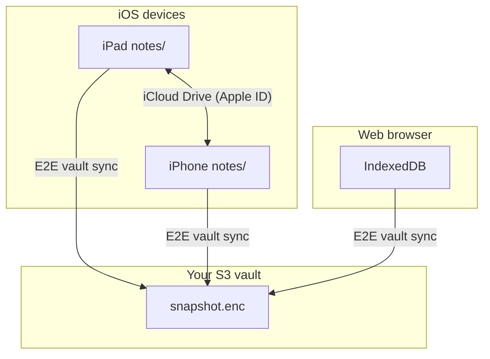

# Passwordless Vault Sync + iCloud Reality Check

Design doc for cross-platform notes sync without login: one vault per library,
end-to-end encrypted snapshots in S3, and how that relates to iOS iCloud storage.

## Current state (what you already have)

Notes are already keyed by stable UUIDs across all platforms:

```typescript
// src/services/notesModel.ts
export interface RawNote {
  id: string;
  body: string;
  updatedAt: number;
}
```

| Platform | Local storage | Path / store |
|----------|---------------|--------------|
| Electron | `~/Documents/Mac Markdown/` | `{id}.md` |
| Web | IndexedDB | `mmw-notes` store |
| iOS | Capacitor Filesystem | `notes/{id}.md` in `Documents/` (default) or `Library/NoCloud/` (Settings → Storage; see [ios-icloud.md](./ios-icloud.md)) |

There is **no cloud sync today**. Cloud sync is explicitly deferred in
[IMPLEMENTATION_PLAN.md](../IMPLEMENTATION_PLAN.md) (section 5). The app is
local-first; `AppApi` in [shared/types/ipc.ts](../shared/types/ipc.ts) only
exposes CRUD against local storage.

---

## Part 1: S3 vault sync without login

### Concept

One **vault** = one encrypted copy of the entire notes library, addressable by a
**Vault ID** the user copies between devices. A **passphrase** (never sent to
the server) derives crypto keys client-side. The server/S3 only ever sees
ciphertext.



### Key design decisions

**Two secrets, two jobs**

| Secret | Purpose | Stored where |
|--------|---------|--------------|
| **Vault ID** (128-bit UUID, e.g. `vlt_…`) | Public address of the vault in S3; needed on every device | Settings (`syncVaultId`) — safe to display as “Sync code” |
| **Passphrase** (user-chosen) | Derives encryption + write keys via Argon2id + HKDF | **Never persisted** — only held in memory during sync; user re-enters on new devices |

From the passphrase (client-only):

- `encryptionKey` → AES-256-GCM encrypt/decrypt the note bundle
- `writeToken` → sent as `Authorization: Bearer …` on uploads; server stores **only** `SHA-256(writeToken)` at vault creation

Anyone who discovers the Vault ID alone gets encrypted blobs they cannot read
and cannot overwrite.

**What gets uploaded**

A single encrypted **snapshot** (simplest v1) rather than per-note S3 objects:

```json
// Plaintext inside the encrypted envelope (before AES-GCM)
{
  "version": 1,
  "notes": [ { "id": "…", "body": "…", "updatedAt": 1730000000 } ],
  "deletedIds": ["…"],
  "syncedAt": 1730000000
}
```

S3 layout:

```
s3://mmw-sync/
  vaults/{vaultId}/
    snapshot.enc          # ciphertext + nonce + tag
    meta.json             # { updatedAt, size, schemaVersion }  (unencrypted, for cheap HEAD/list)
```

Per-note IDs remain the note primary keys **inside** the bundle — you do not
need a separate “note sync ID.” The Vault ID is the cross-environment link.

**Merge strategy (v1)**

Last-write-wins per note `id` on merge (matches existing
[capacitorApi.ts](../src/ios/capacitorApi.ts) merge logic). On sync:

1. Decrypt remote snapshot → `remoteNotes`
2. Read local via `listNotes()` → `localNotes`
3. For each `id`: keep whichever has higher `updatedAt`; union `deletedIds`
4. Write merged set locally via existing `writeNote` / `deleteNote`
5. Re-encrypt merged snapshot and upload if local had changes or remote was newer

**Where it lives in the codebase**

Add a **sync service** (`src/services/vaultSync.ts`) that sits **above**
platform shims — it does not replace `AppApi`. Extend settings + UI only:

- New `AppApi` methods (optional, implemented on web + iOS first; Electron can follow):
  - `createVault(): Promise<{ vaultId }>`
  - `pullVault({ vaultId, writeToken }): Promise<void>`
  - `pushVault({ vaultId, writeToken }): Promise<void>`
- Or keep sync entirely in a service that calls `fetch('/api/vault/…')` directly
  and uses existing `notesStore` for local CRUD — **prefer this** to avoid
  bloating `AppApi` until Electron needs it.

Settings keys (via existing `getSetting`/`setSetting`):

- `syncVaultId` — the vault address
- `syncEnabled` — boolean
- `lastSyncedAt` — timestamp for UI

**Backend (Vercel serverless + S3)**

New `api/` routes (fits existing [vercel.json](../vercel.json) static deploy):

| Route | Behavior |
|-------|----------|
| `POST /api/vault` | Create vault: generate `vaultId`, accept `writeTokenHash`, return `vaultId` |
| `GET /api/vault/:id/meta` | Return `meta.json` (for “is remote newer?” checks) |
| `GET /api/vault/:id/snapshot` | Stream `snapshot.enc` |
| `PUT /api/vault/:id/snapshot` | Require `Authorization: Bearer {writeToken}`; write to S3 |

Env vars: `VAULT_S3_ACCESS_KEY_ID`, `VAULT_S3_SECRET_ACCESS_KEY`,
`VAULT_S3_REGION`, `VAULT_S3_BUCKET`, `VAULT_S3_PREFIX=mmw-sync`.
(Renamed from the original `AWS_*` draft — Vercel reserves the `AWS_*`
names on its function runtime.)

**No AWS creds in the client** — all S3 access goes through the API.

**UX flow**

1. **Enable sync** (Settings): user sets passphrase → app derives keys → creates
   vault → shows **Sync code** (`vaultId`) with copy button + warning to save
   passphrase
2. **Link device**: enter Sync code + passphrase → pull → merge → local library
   updated
3. **Ongoing**: manual “Sync now” button first; optional background sync on app
   focus / interval later
4. **Passphrase lost**: data is unrecoverable (by design for E2E) — surface this
   clearly

**Cost / abuse controls**

- S3 lifecycle: no versioning v1 (overwrites are fine)
- API rate limiting per `vaultId` + max snapshot size (e.g. 5–10 MB)
- Optional: one-time vault creation captcha if abuse appears

### What this does *not* solve (v1)

- Real-time collaborative editing
- Conflict UI (v1 is silent LWW)
- Desktop Electron (local folder is separate unless you add the same sync service there)
- Syncing *settings* (palette, font) — only notes library

---

## Part 2: iCloud — will iPad + iPhone stay in sync?

### Short answer for **today’s build**

**No — not via iCloud.** Settings → Storage on iOS chooses between two
*local* sandbox locations; neither writes to an iCloud Drive ubiquity
container. Cross-device sync is the encrypted vault (Part 1).

Current behavior (`src/ios/notesStorage.ts`, issue #8 / W-000008):

| Setting | Capacitor directory | Physical path | Cross-device? |
|---------|---------------------|---------------|---------------|
| Documents & Backup (default) | `Directory.Documents` | `Documents/notes/` | No — device backup only; Files-visible after the plist steps in [ios-icloud.md](./ios-icloud.md) |
| On device | `Directory.LibraryNoCloud` | `Library/NoCloud/notes/` | No — app-private, excluded from backup |

Switching moves the whole library (copy → verify → activate → clean up, with
the sync sidecar `.vault-meta.json` — canonical `times` and `tombstones` —
carried along), so a vault sync sees the same ids and timestamps before and
after a switch.

`Directory.Documents` = **app sandbox Documents**, which is:

- Included in **device backup** (restore on a new device from backup)
- Files-visible after Info.plist steps in [ios-icloud.md](./ios-icloud.md)
- **Not** the same as iCloud Drive document sync between a live iPad and iPhone

So two devices signed into the same Apple ID will **not** automatically see each
other’s notes with the current implementation — use the vault.

### If true iCloud Documents were implemented (deferred)

Per [ios-icloud.md](./ios-icloud.md), a third option would look like:

| Setting | Location | Cross-device? |
|---------|----------|---------------|
| iCloud Drive (with entitlement + native bridge) | Ubiquity container `iCloud.com.andrewsolomon.macmarkdownworkspace` → `Documents/notes/` | **Yes**, via iCloud Drive (eventual consistency) |
| Documents & Backup | App sandbox `Documents/notes/` | No |
| On device | App sandbox `Library/NoCloud/notes/` | No |

**Folder structure** (once the native bridge lands): all notes in a named app
folder inside the ubiquity container, e.g.:

```
iCloud Drive/
  Mac Markdown/          ← NSUbiquitousContainerName
    notes/
      {uuid}.md
      {uuid}.md
```

**Caveats even with real iCloud:**

- Same Apple ID + iCloud Drive enabled on both devices
- Sync is **eventual**, not instant — edits can conflict; iOS picks a winner per file
- Airplane mode / low power can delay sync
- iCloud storage quota applies
- Web app cannot participate in iCloud sync

### iCloud vs S3 vault sync

These are **orthogonal** paths:



A user could theoretically enable both iCloud (iPad↔iPhone) **and** S3 vault
(web↔iOS) — that risks **divergent copies** unless you pick one source of truth
or add conflict detection. Recommendation: **market them as alternatives** in
Settings copy.

---

## Part 3: Recommended implementation phases

### Phase A — Crypto + sync service (client only, mocked API)

- `src/services/vaultCrypto.ts` — Argon2id (or `@noble/hashes` scrypt), HKDF, AES-256-GCM envelope
- `src/services/vaultSync.ts` — merge logic, snapshot pack/unpack
- Unit tests for encrypt/decrypt round-trip and LWW merge

### Phase B — Vercel API + S3 bucket

- `api/vault/[id]/snapshot.ts`, `api/vault/index.ts`
- Private S3 bucket, IAM user scoped to `mmw-sync/vaults/*`
- Deploy alongside existing web app on Vercel

### Phase C — Settings UI

- Extend [SettingsPanel.tsx](../src/components/shell/SettingsPanel.tsx):
  - “Cloud sync” section: Enable / Sync code display / Link vault / Sync now / Last synced
  - Passphrase entry modal (not persisted)
  - Strong copy: passphrase loss = data loss

### Phase D — Platform wiring

- Web: call vault sync from [browserApi.ts](../src/web/browserApi.ts) entry or `NotesShell` on load when `syncEnabled`
- iOS: same from [capacitorApi.ts](../src/ios/capacitorApi.ts) / app init
- Electron (optional): same service; local `~/Documents/Mac Markdown` remains canonical offline

### Phase E — iCloud ubiquity (separate track) — DEFERRED

Parked by decision on 2026-07-06: S3 vault sync (A–D) is the shipped cross-device
solution and covers iPad ↔ iPhone ↔ web. iCloud Drive would only add
Apple-device ↔ Apple-device, excludes the web app, and running both risks
divergent copies (Part 2). Not started; the plan below stands if it's ever revived.

- Native Capacitor plugin or bridge to write `notes/` into the ubiquity container
- Update [ios-icloud.md](./ios-icloud.md) when landed
- Does not replace S3 vault for web

---

## Security checklist

- Passphrase never leaves the device; never log keys or plaintext
- `writeToken` transmitted only over HTTPS on upload
- Store `writeTokenHash` server-side, not the token
- Use random 96-bit nonce per snapshot encryption
- Consider `@noble/ciphers` + `@noble/hashes` (small, auditable) over rolling crypto by hand
- Document threat model: vault ID + passphrase = full access; no account recovery

---

## Open product decisions (minor, can default)

- **Auto-sync on edit** vs manual “Sync now” only for v1 → default **manual** (simpler, fewer race conditions)
- **Passphrase change** → re-encrypt and re-upload (v2)
- **Vault deletion** → API endpoint + S3 delete (v2)

---

## Implementation checklist

- [x] Add `vaultCrypto.ts`: scrypt/HKDF key derivation + AES-256-GCM snapshot envelope (Phase A, issue #19)
- [x] Add `vaultSync.ts`: pack/unpack `RawNote[]`, LWW merge, pull/push orchestration (Phase A, issue #19)
- [x] Create Vercel API routes + private S3 bucket with write-token auth (Phase B, issue #20)
- [x] Settings panel: enable sync, show vault ID, link device, sync now, passphrase modal (Phase C/D, issue #21)
- [x] Hook vault sync into web and iOS app init / manual sync trigger (Phase C/D, issue #21)
- [ ] Separate track: native bridge for true iCloud Documents container ([ios-icloud.md](./ios-icloud.md) steps) — **intentionally deferred (2026-07-06)**: the S3 vault (Phases A–D) already syncs iPad ↔ iPhone ↔ web, so the iCloud ubiquity bridge is redundant for the cross-device need; it also can't include the web app and would risk divergent copies if run alongside the vault (see Part 2). Revisit only if an Apple-only, no-account, offline-LAN sync path is wanted.

---

## Phase A implementation notes (security-review round, 2026-07-06)

Decisions locked while addressing the Phase A security review:

- **KDF**: scrypt `N=2^17, r=8, p=1` (~128MB memory-hard, OWASP tier) instead of Argon2id — comparable memory-hardness, zero WASM, ships in `@noble/hashes`. Params are baked into every vault's derivation; changing them means a new envelope version. The offline threat is explicit: anyone with vault id + ciphertext can brute-force the passphrase unthrottled, so `createVault` enforces a minimum length (8) and the Phase C UI should push far past it.
- **AAD binding**: the AES-GCM envelope authenticates `mmw-v1:<vaultId>` as additional data — a snapshot can't be spliced into another vault or reinterpreted under a future envelope version.
- **Deletions**: local deletes must record a `VaultTombstone {id, deletedAt}` via the platform adapter (`LocalNotesPort`), or they resurrect from the vault on the next sync. Tombstones fold into the snapshot's `deletedIds` on sync and are cleared after a confirmed push. An edit newer than the deletion resurrects the note, in both directions.
- **Timestamps**: `LocalNotesPort.writeNote` persists the given `updatedAt` verbatim — re-stamping pulled notes with "now" corrupts LWW across 3+ devices.
- **Concurrency**: `getSnapshot` returns an opaque `etag`; `putSnapshot` takes `ifMatch` and throws `VaultConflictError` on precondition failure (S3 conditional write / HTTP 412 in Phase B). `syncVault` re-pulls, re-merges, and retries up to 3 times.
- **Schema**: clients refuse snapshots with `version > 1` rather than mis-merging them.
- **Known limitation**: LWW compares wall-clock `updatedAt` across devices; clock skew can pick the "wrong" winner for near-simultaneous edits. Acceptable for manual sync; a logical version counter is the v2 fix.

## Phase B implementation notes (2026-07-06)

- **Routes** live in `api/vault/` (Vercel Node functions; `api/_lib/` is shared, non-routed code). The vault id is **client-generated** (Phase A's `generateVaultId`), so `POST /api/vault` registers rather than mints — the server validates the strict `vlt_<uuid>` shape and rejects re-registration with 409 (S3 `If-None-Match: *` on `auth.json`).
- **`writeTokenHash` is stored in a private `auth.json`**, not in the publicly readable `meta.json`; the PUT handler compares SHA-256 of the presented bearer token in constant time.
- **Optimistic concurrency end-to-end**: the snapshot's S3 ETag rides the `ETag` response header; clients send `If-Match` (or `If-None-Match: *` for first push), which maps onto S3 conditional writes → 412 → `VaultConflictError` → re-merge and retry.
- **Caps**: snapshot bodies over 4MB are rejected (Vercel's own ceiling is 4.5MB); CORS is `*` because the iOS app calls from a `capacitor://` origin — content is ciphertext and writes are token-gated. Per-vault rate limiting is deferred until abuse appears (doc's "cost/abuse" note).
- **Infra** (account 048674617441, us-east-1): private bucket `mmw-vault-sync-048674617441` (public access blocked, SSE-S3), IAM user `mmw-vault-sync` allowed only Get/Put/List under the `mmw-sync/` prefix. Env vars set in Vercel **production** (secret is write-only "sensitive"); preview deploys intentionally unconfigured.
- **Client**: `src/services/vaultHttpTransport.ts` implements the Phase A `VaultTransport` port over `fetch`; web uses same-origin `""`, iOS must pass the absolute production origin.

### Phase B security-review round (2 passes, both addressed)

- **Stored-XSS on the snapshot GET (HIGH, fixed)**: `@vercel/node`'s `res.send(string)` defaults to `Content-Type: text/html`. A crafted `ct` served from our own origin could execute script against the web app's IndexedDB. Fixed by setting `application/json` + `X-Content-Type-Options: nosniff` explicitly on the GET, and tightening `isValidEnvelope` to require exactly `{v,nonce,ct}` with base64-shaped, length-bounded fields (rejects markup and unknown keys before anything is stored).
- **Unauthenticated create abuse (MEDIUM, mitigated)**: `POST /api/vault` is intentionally login-free, so a Vercel Firewall rate-limit rule caps it at **5 creations / minute / IP** (denies at the edge before any S3 write). Read paths stay open but are gated behind 122-bit unguessable vault ids. Firewall config lives in the Vercel project, not the repo — re-create it if the project is rebuilt.
- **meta.json is advisory-only (LOW, documented in code)**: the snapshot's S3 conditional PUT is the atomic source of truth; the follow-up meta PUT is unordered and can transiently regress. Phase C must derive "is remote newer?" from the snapshot **ETag**, never `meta.updatedAt`.
- Transport now maps 413 → "library too large" and 404 → "vault no longer exists"; the constant-time token check rejects a malformed stored hash explicitly rather than relying on `Buffer.from`'s silent truncation.

## Related docs

- [visual-testing.md](./visual-testing.md) — Playwright screenshots, web/WebKit projects, iOS Simulator
- [ios-icloud.md](./ios-icloud.md) — iOS storage and Files visibility
